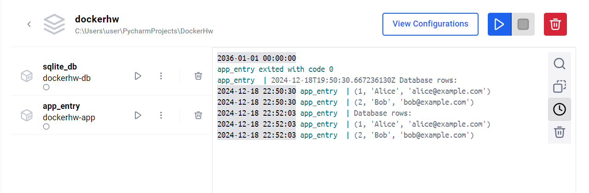

# Проект с двумя контейнерами: SQLite и клиент

Этот проект демонстрирует работу с двумя Docker-контейнерами:
- **SQLite** — база данных, хранящая данные.
- **Клиент (app_entry)** — Python-приложение, которое подключается к базе данных и выводит содержимое.

Данные в базе сохраняются даже после остановки и повторного запуска контейнеров благодаря использованию **Docker volume**.

---

## 📦 **Запуск контейнеров**

1. **Собрать и запустить контейнеры**  
   В корневой папке проекта выполни команду:
   ```bash
   docker-compose up --build
   ```

2. **Просмотр данных из SQLite**  
   Второй контейнер (`app_entry`) должен показать данные из базы данных SQLite:
   ```plaintext
   Database rows:
   (1, 'Alice', 'alice@example.com')
   (2, 'Bob', 'bob@example.com')
   ```

   Если необходимо, можно просмотреть логи контейнера `app_entry` в другом терминале:
   ```bash
   docker logs app_entry
   ```

3. **Остановка контейнеров**  
   Для остановки и удаления контейнеров:
   ```bash
   docker-compose down
   ```

4. **Повторный запуск контейнеров**  
   Данные в базе данных сохраняются между перезапусками благодаря volume:
   ```bash
   docker-compose up
   ```

---

## 📁 **Структура проекта**

```plaintext
project/
│-- docker-compose.yml      # Конфигурация для Docker Compose
│-- db/                     # Папка с настройками БД
│   ├── Dockerfile          # Dockerfile для SQLite
│   └── init.sql            # SQL-скрипт для инициализации базы данных
│-- app/                    # Папка с клиентским приложением
│   ├── Dockerfile          # Dockerfile для Python-приложения
│   └── main.py             # Python-скрипт для запроса данных
│-- README.md               # Документация проекта
```

---

## 🛠️ **Основные команды**

- **Сборка и запуск**:
   ```bash
   docker-compose up --build
   ```

- **Просмотр логов контейнера**:
   ```bash
   docker logs app_entry
   ```

- **Остановка контейнеров**:
   ```bash
   docker-compose down
   ```

- **Удаление volume** (если нужно удалить сохранённые данные):
   ```bash
   docker volume rm project_db-data
   ```

---

## 🖼️ **Скриншот проекта**



---